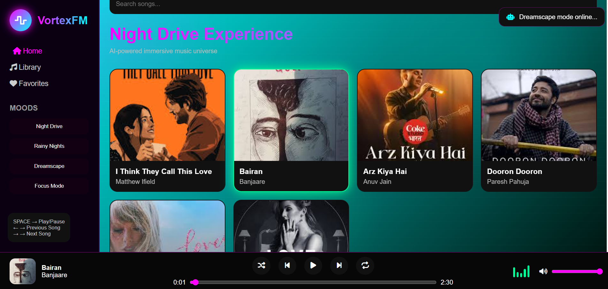
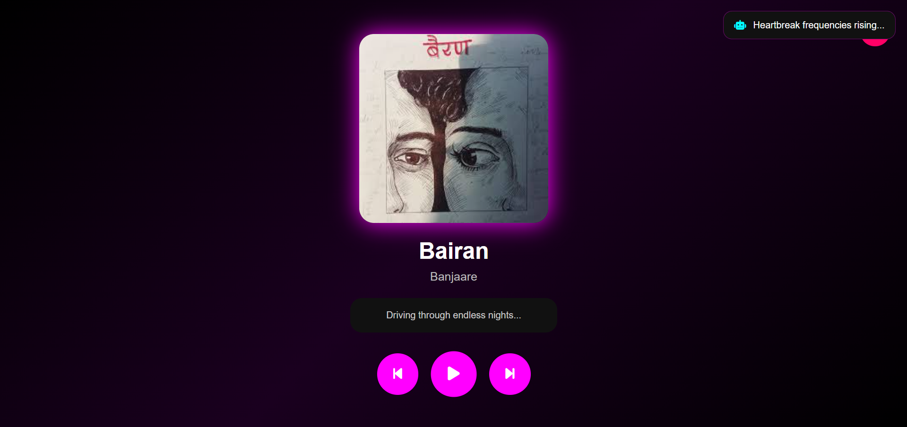

# VortexFM 🎵

Cyberpunk-inspired futuristic music player built using HTML, CSS and JavaScript.

## 🚀 Live Demo

https://vortex-fm.vercel.app/

## ✨ Features

* Fullscreen immersive player
* Animated visualizer
* Dynamic neon gradients
* AI DJ mode
* Mood engine
* Rain animation
* Particle universe
* Search songs
* Shuffle & repeat
* Responsive mobile design
* Keyboard shortcuts
* LocalStorage memory

## 🛠 Tech Stack

* HTML5
* CSS3
* JavaScript
* Git & GitHub
* Vercel Deployment

## 👨‍💻 Author

HeerakerPoojamaheshwari

## 📸 Screenshots

### Home Page

### Fullscreen Player

